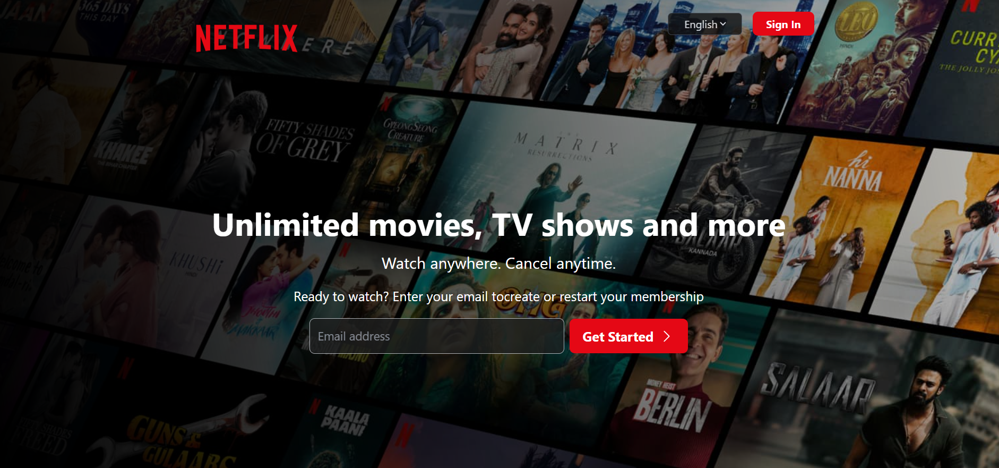

# 🎬 Netflix Clone



A responsive Netflix-inspired web application built with React, Vite, and Tailwind CSS.

A responsive **Netflix-inspired web application** built with **React.js, Vite, and Tailwind CSS**. This project recreates the look and feel of a Netflix landing page with responsive navigation, hero content, promotional sections, FAQ, and a sign-in page.

> **Educational / Portfolio Project:** This is a Netflix-inspired clone created for learning and portfolio purposes. It is not affiliated with or endorsed by Netflix.

## 🌐 Live Demo

**Live Website:**  
https://netflix-clone-main-xi.vercel.app/

## 📂 GitHub Repository

**GitHub:**  
https://github.com/Omkar-Nirgude/Netflix-Clone-main

## ✨ Features

- 🎬 Netflix-inspired landing page
- 📱 Fully responsive design
- 🧭 Responsive navigation bar
- 🔴 Netflix-style branding and hero section
- 🌍 Language selector
- 🔐 Sign-in page
- 📧 Email input and "Get Started" section
- 📺 Movie and TV-show promotional sections
- ⬇️ Download section
- ▶️ Watch section
- ❓ Frequently Asked Questions (FAQ)
- 🦶 Footer section
- 🎥 Video content
- ⚡ Fast development with Vite
- 🎨 Tailwind CSS styling
- 🧭 React Router navigation
- 🚀 Deployed on Vercel

## 🛠️ Technologies Used

| Technology | Purpose |
|---|---|
| React.js | Frontend UI development |
| Vite | Development server and build tool |
| Tailwind CSS | Styling and responsive design |
| JavaScript (ES6+) | Application logic |
| React Router DOM | Page navigation |
| React Icons | Icons |
| Axios | HTTP requests |
| React Hot Toast | Toast notifications |
| Styled Components | Component styling |
| Git & GitHub | Version control |
| Vercel | Deployment |

## 📁 Project Structure

```text
Netflix-Clone-main/
│
├── public/
│   ├── video/
│   │   ├── v1.mp4
│   │   ├── v2.mp4
│   │   └── v3.mp4
│   ├── Netflix.svg
│   └── ...
│
├── src/
│   ├── assets/
│   │   ├── Netflix_Logo_RGB.png
│   │   └── Netflix_background.jpg
│   │
│   ├── components/
│   │   ├── CreateProfile.jsx
│   │   ├── Download.jsx
│   │   ├── Enjoy.jsx
│   │   ├── Faq.jsx
│   │   ├── Footer.jsx
│   │   ├── HeroSection.jsx
│   │   ├── Navbar.jsx
│   │   └── Watch.jsx
│   │
│   ├── data/
│   │   └── faqData.js
│   │
│   ├── pages/
│   │   ├── Home.jsx
│   │   └── registration/
│   │       └── Signin.jsx
│   │
│   ├── App.jsx
│   ├── App.css
│   ├── index.css
│   └── main.jsx
│
├── index.html
├── package.json
├── package-lock.json
├── tailwind.config.js
├── postcss.config.js
├── vite.config.js
└── README.md
```

## 🚀 Run the Project Locally

### 1. Clone the repository

```bash
git clone https://github.com/Omkar-Nirgude/Netflix-Clone-main.git
```

### 2. Navigate to the project

```bash
cd Netflix-Clone-main
```

### 3. Install dependencies

```bash
npm install
```

### 4. Start the development server

```bash
npm run dev
```

The project will normally run at:

```text
http://localhost:5173
```

## 🏗️ Production Build

Create a production build:

```bash
npm run build
```

Preview the production build locally:

```bash
npm run preview
```

## 📦 Important Dependencies

```json
{
  "@tailwindcss/vite": "^4.0.14",
  "axios": "^1.8.4",
  "react": "^19.0.0",
  "react-dom": "^19.0.0",
  "react-hot-toast": "^2.5.2",
  "react-icon": "^1.0.0",
  "react-icons": "^5.5.0",
  "react-router-dom": "^7.3.0",
  "styled-components": "^6.1.17",
  "tailwindcss": "^4.0.14"
}
```

## 🚀 Deployment

The project is deployed on **Vercel**.

### Live URL

https://netflix-clone-main-xi.vercel.app/

Whenever changes are pushed to the connected GitHub repository, Vercel can automatically create a new deployment.

## 🔄 Git Workflow

After making changes locally:

```bash
git add .
git commit -m "Update project"
git push
```

The updated code can then be deployed automatically through the connected Vercel project.

## 👨‍💻 Author

**Omkar Nirgude**

- GitHub: https://github.com/Omkar-Nirgude
- LinkedIn: https://www.linkedin.com/in/omkar-nirgude-325462368

## 📄 Disclaimer

This project is developed for **educational and portfolio purposes**. Netflix and its associated branding, trademarks, and content belong to their respective owners.

## ⭐ Feedback

If you find this project useful, feel free to explore the repository and give it a ⭐ on GitHub.
